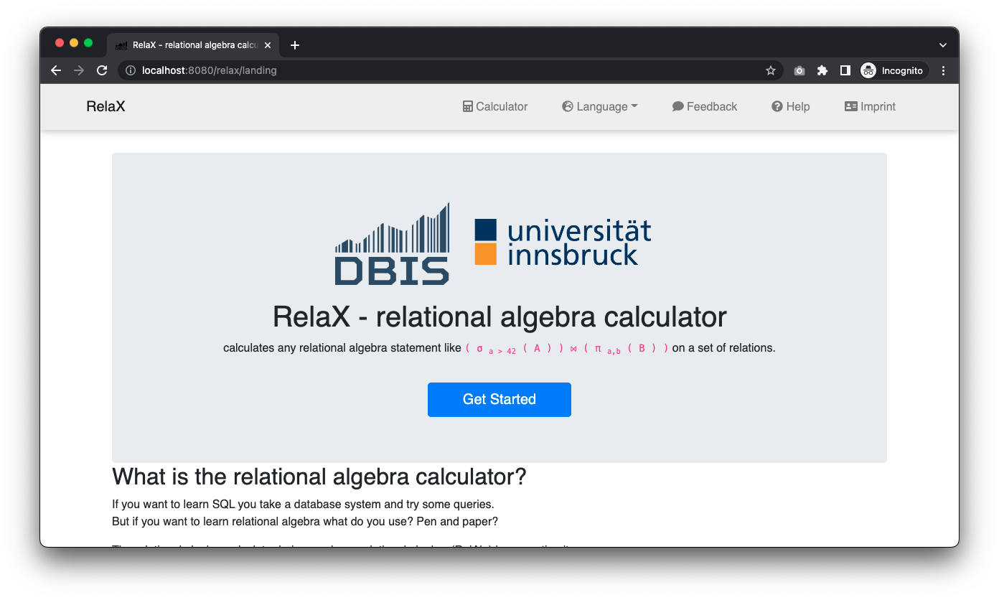

# relax-api
A REST API to integrate RelaX with third-party applications.

This implementation provides a workaround to facilitate the integration of [RelaX - relational algebra calculator](https://dbis-uibk.github.io/relax/) with third-party applications/systems. **Why is it necessary? Because RelaX Query API does not work as an actual REST API!** RelaX is implemented in React JS, a UI framework, to load data asynchronously on a single page application. This approach returns a Web page that does not include the data. More information regarding this issue can be found [here](https://github.com/dbis-uibk/relax/pull/148).

## HOW TO BUILD IT:

* Install Git (https://github.com/git-guides/install-git).
* Install Yarn (https://yarnpkg.com/).
* Install Node@12 (https://nodejs.org/en/).
* Clone this repo and set it as your working directory.

        git clone https://github.com/rlaiola/relax-api.git
        cd relax-api

* Clone RelaX repo* and checkout the static files (branch `gh-pages`).

        mkdir dist && \
        cd dist && \
        git clone https://github.com/rlaiola/relax.git && \
        cd relax && \
        git branch -a && \
        git checkout origin/gh-pages && \
        git checkout gh-pages && \
        git branch && \
        cd ../..
 
**NOTE:** As of Jul 17th 2021, RelaX main repo had not yet accepted the changes necessary for this REST API to work. That's the reason why you should clone the forked project.

* Execute `yarn install` to install all dependencies.
* Execute `yarn serve` to locally run the Web application on port 8080 and the Query API on port 3000.

**NOTE:** This implementation uses ports 8080 (RelaX Web app) and 3000 (RelaX Query API). These ports can me changed by setting the variables RELAX_PORT and RELAX_API_PORT, respectively, as shown below:

        RELAX_PORT=80 RELAX_API_PORT=4000 yarn serve

## HOW TO TEST IT:

* Open a Web browser window and visit the URL http://localhost. Voilà! RelaX Web application should work properly.

    

        
    

* Run the following command to test RelaX Query API. You should get the query result encoded in JSON format.

        curl http://127.0.0.1:3000/relax/api/local/uibk/local/0?query=UiBqb2luIFMgam9pbiBU

    

        
    

## Increasing GitHub rate limit for API requests using Basic Authentication

RelaX Web application and API may need to make calls to GitHub API (i.e., to download datasets specified in GitHub Gists). According to the [documentation](https://docs.github.com/en/rest/overview/resources-in-the-rest-api#rate-limiting), _"for unauthenticated requests, the rate limit allows for up to 60 requests per hour. Unauthenticated requests are associated with the originating IP address, and not the user making requests."_ On the other hand, _"for API requests using Basic Authentication ..., you can make up to 5,000 requests per hour."_ Follow the steps below in order to take advantage of a larger request limit:

1. Read these [instructions](https://docs.github.com/en/github/authenticating-to-github/keeping-your-account-and-data-secure/about-authentication-to-github#authenticating-with-the-api) to create a personal access token to authenticate with GitHub API.

1. Then, start the application setting the GITHUB_ACCESS_TOKEN environment variable (replace the word 'my_token' with the actual personal access token generated in the previous step).

        GITHUB_ACCESS_TOKEN=my_token yarn serve
    
**NOTE:** You can check the current and remaining limits using the following command (replace the word 'my_token' with the actual personal access token created before). For details check the [documentation](https://docs.github.com/en/rest/guides/getting-started-with-the-rest-api).
    
        curl -H "Authorization: token my_token" -I https://api.github.com/users/octocat/orgs

## LICENSE:

Copyright 2021 Rodrigo Laiola Guimarães

This program is free software: you can redistribute it and/or modify
it under the terms of the GNU General Public License as published by
the Free Software Foundation, either version 3 of the License, or
(at your option) any later version.

This program is distributed in the hope that it will be useful,
but WITHOUT ANY WARRANTY; without even the implied warranty of
MERCHANTABILITY or FITNESS FOR A PARTICULAR PURPOSE.  See the
GNU General Public License for more details.

You should have received a copy of the GNU General Public License
along with this program.  If not, see <https://www.gnu.org/licenses/>.

This program is released under license GNU GPL v3+ license.

## SUPPORT:

Please report any issues with relax-api at https://github.com/rlaiola/relax-api/issues
